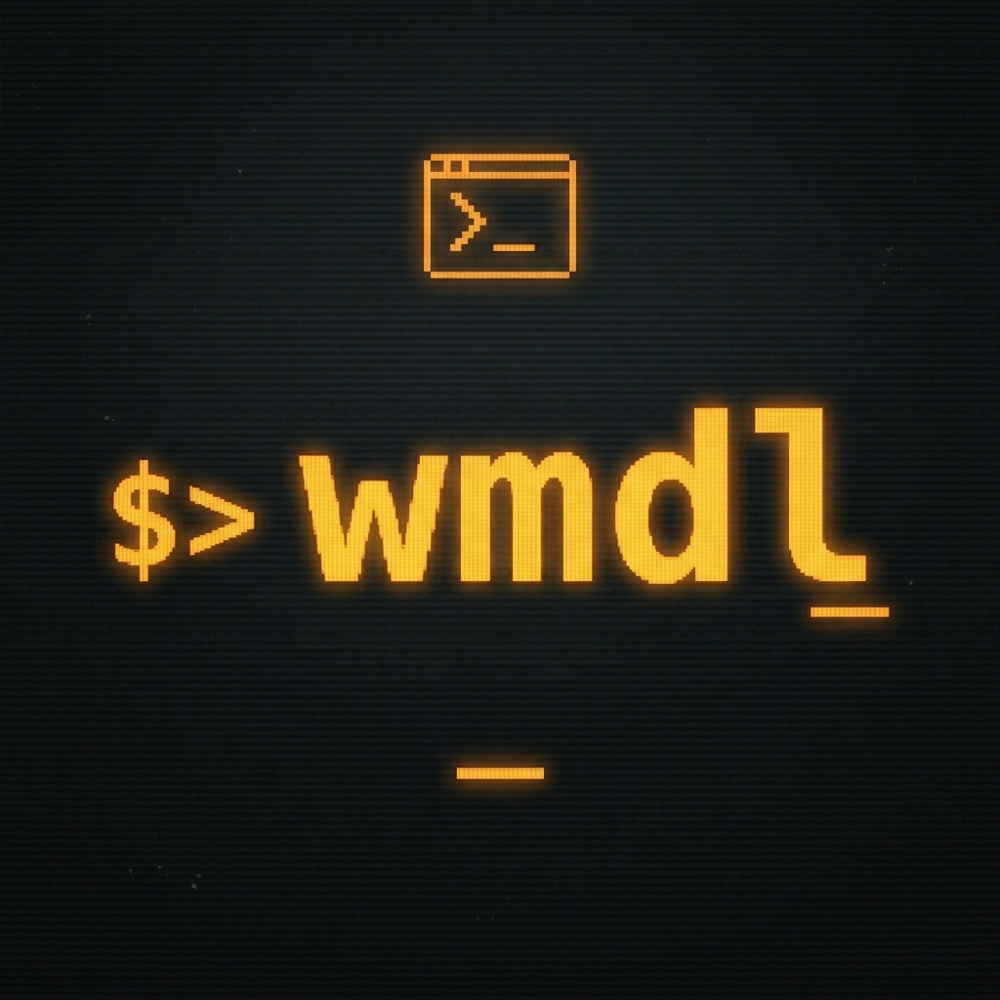

# wmdl Documentation



## Installation

```bash
go install github.com/pdfrg/wmdl/cmd/wmdl@latest
```

Or build locally:

```bash
git clone https://github.com/pdfrg/wmdl
cd wmdl
make build
```

## Configuration

Required settings in `~/.config/wmdl/config.yaml`:
- `tmdb.api_key` — get one free at https://www.themoviedb.org/settings/api
- `prowlarr.url` + `prowlarr.api_key`
- One downloader (`qbittorrent`, `transmission`, or `deluge`) with URL and credentials

Optional: `radarr.url` + `radarr.api_key` for automated library management,
`sonarr.url` + `sonarr.api_key` for TV shows, `notifier` for webhook notifications
(Gotify, Slack, Discord, ntfy, or generic webhook).

Full example at [config.yaml.example](config.yaml.example).

## Commands

### `wmdl help`

```
Automated workflow for discovering, reviewing, and downloading 
weekly DVD/streaming releases via Prowlarr, your preferred torrent client, and Radarr/Sonarr.

Usage:
  wmdl [command]

Available Commands:
  all         Run full pipeline: discover, review, and process
  catchup     Run all pending steps for incomplete weeks
  completion  Generate the autocompletion script for the specified shell
  discover    Scrape release sources and notify
  help        Help about any command
  process     Search and download approved releases
  review      Review pending releases in TUI
  status      Show status of recent weeks

Flags:
      --config string   config file path
  -h, --help            help for wmdl
  -v, --version         version for wmdl

Use "wmdl [command] --help" for more information about a command.
```

### `wmdl all`

Run discover → review → process in sequence for the current week. The full pipeline
in one command.

### `wmdl discover`

Scrape release websites, enrich metadata (TMDB, IMDb, Rotten Tomatoes), save to SQLite database,
and optionally send a notification.

Flags: `--headless` (no browser window, for cron/systemd)

### `wmdl review`

Opens a Bubble Tea TUI showing all pending releases. Approve or reject each one. Shows poster
art, ratings, genre, and summary for each title.

### `wmdl process`

For each approved release: searches Prowlarr with an optionally configured preferred indexer
(perfect for your private tracker), falls back to all Prowlarr indexers, filters results by
your quality preferences (resolution, source type, codec, preferred groups, min seeders),
opens a release picker TUI, then sends the chosen release to your download client and adds
it to Radarr/Sonarr.  If adding a new show season >1, offers to search prior seasons.

Supports two modes:
- `batch` (default): searches all items first, then presents them
- `interactive`: searches and presents each item just-in-time

### `wmdl status`

Displays a week-by-week progress table showing which weeks have been discovered, reviewed,
 and processed.

### `wmdl catchup`

Advances each incomplete week by one step per invocation. Run it repeatedly to catch up weeks
in order.

### Target a specific week

```bash
wmdl all --week 2025-W14       # ISO week
wmdl all --week 2025-03-31     # date
wmdl all --week last           # previous week
wmdl all --week next           # next week
wmdl all --week -3             # 3 weeks ago
```

## wmdl "week" definition

For `wmdl` the week runs from Wednesday to the following Tuesday (physical media release day).
Automated setups run `wmdl discover` every Wednesday morning by default.  Occasionally, physical
media is released on other days of the week, and will be grouped with the Tuesday releases as a 
trackable unit, to help prevent any missed weeks or missed releases. As noted below, `wmdl`
searches for streaming media released 2 months earlier than physical. These releases are grouped
with the physical releases into the same week "unit" to simplify tracking.

**To illustrate...**

Physical release day: Tuesday May 19.

`wmdl` week: Wednesday May 13 - May 19.

Streaming media search: March 13 - March 19.

Output of `wmdl status`:
```
Week      Date        Discover  Review  Process
────────  ──────────  ────────  ──────  ───────
W21 2026  2026-05-19  ✓         ✓       ✓    

All caught up!
```

## Architecture

```
discover  →  review  →  process
   │            │           │
 scrape      TUI       Prowlarr search
 TMDB/RT   approve/    release picker
 enrich     reject     download + library
   │            │           │
   └────────────┴───────────┘
              SQLite
        (~/.local/share/wmdl/)
```

### Discover phase (CLI)

Three sources are utilized:
- **dvdsreleasesdates.com** — physical DVD/Blu-ray releases (each Tuesday)
- **TMDB Discover API** — streaming premieres
- **FlixPatrol** — streaming release calendar, includes extensive non-US and non-English
content

Streaming release discovery is time-shifted 2 months earlier than physical. Targeting
earlier streaming releases allows critic and user review ecosystem to populate, series
with weekly release calendars to finish, and season packs to become available.

Each title is enriched through:
- **TMDB** — TMDB ID, IMDb ID, overview, genres, runtime, poster path, US content rating
- **IMDbAPI** — IMDb rating and Metacritic score
- **Rotten Tomatoes** — critic and audience scores via chromedp web scraping, though often
not available for more niche/non-US content.  Requires installed Chrome-based browser
(Chromium, Brave, Edge, Opera, Vivaldi), though does not need to be default browser.

This phase can easily be automated with `systemd` or `cron` (see below), and configured to
notify you when complete.

### Review phase (TUI)

Bubble Tea TUI with keyboard navigation (j/k to move, a/r to approve/reject, enter to confirm,
o to open RT page). Posters are fetched from TMDB and rendered inline via Kitty image protocol
when supported. Kitty, Ghostty, and Rio terminals all support Kitty images.  Once all selections
are made, review the list of choices, and confirm to save.

### Process phase (CLI + TUI)

1. Prowlarr search with tiered queries (preferred indexer if configured,
resolution-specific → fallbacks)
2. Results filtered by title, year, season number, and media type
3. Releases scored and sorted by quality preferences
4. TUI picker to select the best release(s). Multi-select enabled.
5. Torrents added to download client (qBittorrent/Transmission/Deluge)
6. Download records saved to SQLite
7. Movies/series added to Radarr/Sonarr with selected quality profile after confirmation

**Note: For TV, only season packs are returned.  All single episode releases are filtered.**

### Quality scoring

Releases are scored on:
- Resolution match (separate configuration values for Movies and TV)
- Source type priority (default: bluray > web-dl > webrip > hdtv)
- Codec priority (default: h265/hevc > h264/x264 > av1)
- Preferred release groups
- Minimum seeders filter
- HDR preference

All values are user configurable.

## Automation (weekly discovery)

### Systemd timer

```bash
cp contrib/wmdl-discover.service ~/.config/systemd/user/
cp contrib/wmdl-discover.timer   ~/.config/systemd/user/
systemctl --user daemon-reload
systemctl --user enable --now wmdl-discover.timer
```

Runs `wmdl discover --headless` every Wednesday at 05:00 and optionally sends notification.
Results can then be reviewed and processed at your convenience. Change time or day of week
by editing `wmdl-discover.timer`.

### Cron

```
crontab -e
# add the following line, edit path to your install location if needed, then save and exit
0 5 * * 3 $HOME/go/bin/wmdl discover --headless
```

## Data

SQLite database at `~/.local/share/wmdl/wmdl.db`. Key tables: `titles`, `release_events`, `downloads`, `week_state`.

Logs at `~/.local/state/wmdl/wmdl.log` (also printed to stderr).

## Project structure

```
cmd/wmdl/           — CLI commands (cobra)
internal/discover/  — scrapers (interface-based)
internal/review/    — Bubble Tea TUI list
internal/process/   — Bubble Tea release picker + orchestration
internal/browser/   — chromedp Brave tab grabber
internal/search/    — Prowlarr API client
internal/download/  — download client interface + impls
internal/library/   — Radarr/Sonarr API clients
internal/quality/   — release title parser + scorer
internal/model/     — shared types
internal/db/        — SQLite state
internal/config/    — viper config loader
internal/notifier/  — webhook notifications
```

## Building

```bash
make build   # go build ./cmd/wmdl
make test    # go test ./...
make lint    # golangci-lint run ./...
make check   # fmt + vet + lint + test + build
```
