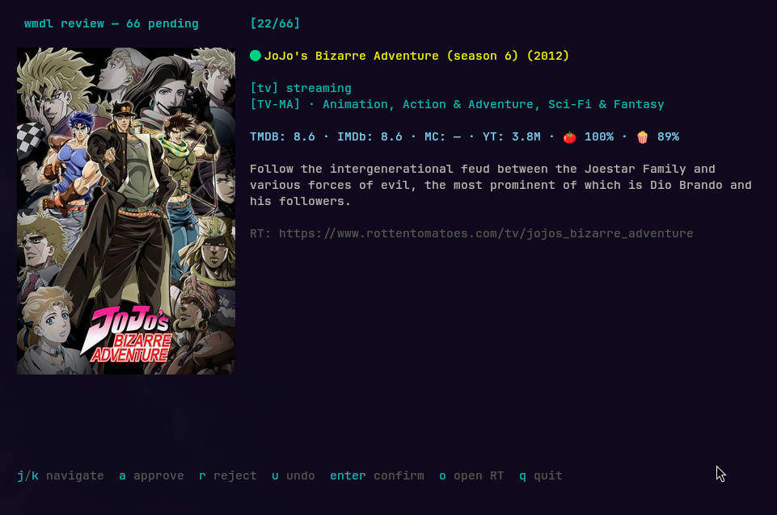
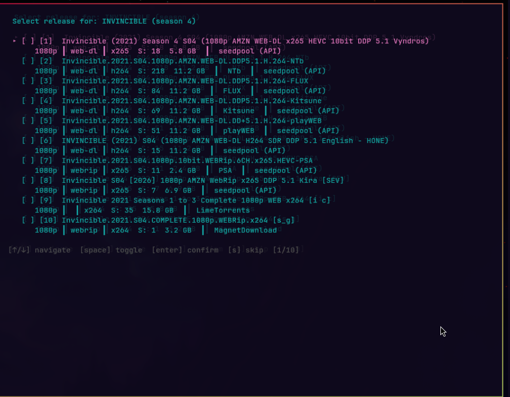

# wmdl

[](https://github.com/pdfrg/wmdl/actions/workflows/ci.yml)

**Weekly Media Downloader** — discover new movies, TV, music, anime, and books each week,
review them in a TUI, then auto-search torrents and add them to your media library. Stop
manually browsing release calendars and copy-pasting titles into Prowlarr. `wmdl` automates
the weekly ritual:



| Media | Scrapers | Library |
|-------|----------|---------|
| Movies | DVD Release Dates, TMDB Discover, FlixPatrol | Radarr |
| TV | DVD Release Dates, TMDB Discover, FlixPatrol | Sonarr |
| Music | Album of the Year, AllMusic | Lidarr |
| Anime | Jikan (MyAnimeList), FlixPatrol | Sonarr |
| Books | Goodreads, Bookshop, LitHub BookMarks | LazyLibrarian |

Compatible with qBittorrent, Transmission, or Deluge. Notifies via Gotify, Slack, Discord,
ntfy, or generic webhook.



## Features

- **Multi-media** — Movies, TV, music, anime, and books with dedicated scrapers, quality
  scoring, and library management in a single tool.
- **Processing modes** — From fully automatic (`yolo`, cron-friendly) to fully manual (`full`).
  Or use `arr` mode to let your *arr handle searching while wmdl curates the queue.
- **Smart filtering** — Content filters (blocked languages/countries/genres), release scoring
  (resolution, codec, source, preferred groups), minimum seeders.
- **Phase 3 gap detection** — When you add a movie in a TMDB collection, wmdl checks if you're
  missing others. Add a TV season > 1? It offers to backfill. Book series? Same.
- **Broad content** — Non-US and non-English media with country-of-origin flags and language info.
- **Status tracking** — `wmdl status` shows a week-by-week progress table; `wmdl catchup` fills
  in gaps.
- **Ad-hoc commands** — `wmdl search` for one-off Prowlarr searches, `wmdl add` to inject titles
  into the pipeline, `wmdl mark-downloaded` for manual bookkeeping.
- **Automation** — Run `wmdl discover --headless` via systemd timer or cron. Example scripts
  for qBittorrent completion hooks and Gotify notifications in [scripts/](scripts/).

## Quick start

```bash
go install github.com/pdfrg/wmdl/cmd/wmdl@latest
cp config.yaml.example ~/.config/wmdl/config.yaml
$EDITOR ~/.config/wmdl/config.yaml   # add TMDB API key + Prowlarr URL + downloader
wmdl all
```

## Documentation

See [DOCUMENTATION.md](DOCUMENTATION.md) for commands, configuration reference, architecture, and automation.

## License

MIT
