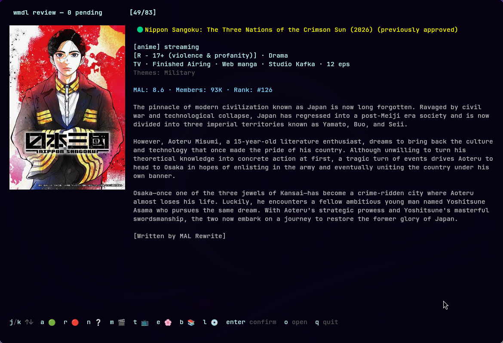
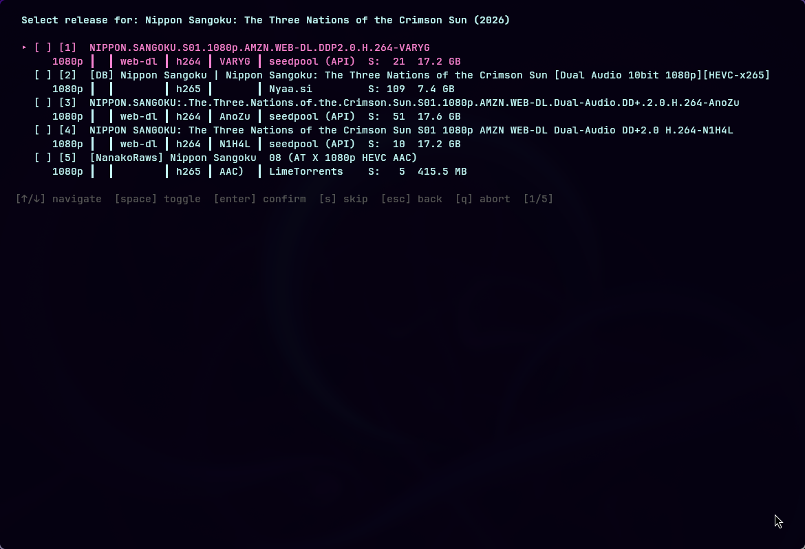

# wmdl — Weekly Media Discovery & downLoader

[](https://github.com/pdfrg/wmdl/actions/workflows/ci.yml)

Discover new movies, TV, music, anime, and books each week,
review them in a TUI, then auto-search torrents and add them to your media library. Stop
manually browsing release calendars and copy-pasting titles into Prowlarr. `wmdl` automates
the weekly ritual:



| Media | Scrapers | Library |
|-------|----------|---------|
| Movies | DVD Release Dates, TMDB Discover, FlixPatrol | Radarr |
| TV | DVD Release Dates, TMDB Discover, FlixPatrol | Sonarr |
| Music | Album of the Year, AllMusic | Lidarr |
| Anime | AniList, Tenrai, Jikan (MAL), FlixPatrol | Sonarr |
| Books | Goodreads, Goodreads Blog, Bookshop, LitHub BookMarks | LazyLibrarian |

Compatible with qBittorrent, Transmission, or Deluge. Notifies via Gotify, Slack, Discord,
ntfy, or generic webhook.



**See more [SCREENSHOTS](SCREENSHOTS.md).**

## Features

- **Multi-media** — Movies, TV, music, anime, and books with dedicated scrapers, quality
  scoring, and library management in a single tool.
- **Processing modes** — From fully automatic (`yolo`, cron-friendly) to fully manual (`full`).
  Or use `arr`, `auto`, or `prowlarr-grab` modes to fine-tune how wmdl and your *arr divide the work.
- **Smart filtering** — Content filters (blocked languages/countries/genres), release scoring
  (resolution, codec, source, preferred groups), minimum seeders.
- **Phase 3 gap detection** — When you add a movie in a TMDB collection, wmdl checks if you're
  missing others. Add a TV season > 1? It offers to backfill. Book series? Same.
- **Broad content** — Non-US and non-English media with country-of-origin flags and language info.
- **Status tracking** — `wmdl status` shows a week-by-week progress table; `wmdl catchup` fills
  in gaps.
- **Ad-hoc commands** — `wmdl search` for one-off Prowlarr searches, `wmdl add` to inject titles
  into the pipeline, `wmdl mark-downloaded` for manual bookkeeping.
- **Real audience scores** — RT ratings strip out Fandango push-votes to reveal what the
  pre-2019 "pull" crowd really thought (method pioneered by [PopcornGap](https://popcorngap.com)).
- **Automation** — Run `wmdl discover --headless` via systemd timer or cron. Example scripts
  for qBittorrent completion hooks and Gotify notifications in [scripts/](scripts/).

## Quick start

```bash
go install github.com/pdfrg/wmdl/cmd/wmdl@latest
cp config.yaml.example ~/.config/wmdl/config.yaml
$EDITOR ~/.config/wmdl/config.yaml   # add TMDB API key + Prowlarr URL + downloader
wmdl all
```

## Requirements

- **To build from source**: Go 1.26+. Or just grab a binary from [releases](https://github.com/pdfrg/wmdl/releases).
- TMDB API key. Account sign-up [here](https://www.themoviedb.org/signup). API key [here](https://www.themoviedb.org/settings/api).  
- Prowlarr
- Download client — qBittorrent (recommended), Transmission, or Deluge

## Recommended

- Chromium-based browser — Chromium, Chrome, or Brave (all recommended; Brave passes
Cloudflare Turnstile challenges since Cloudflare's change, confirmed Sept 2026).
Edge, Vivaldi, and Opera also work. Required for the chromedp-based scrapers; other scrapers work without any browser.
- Radarr, Sonarr, Lidarr, LazyLibrarian — required for `arr, auto, yolo` modes. `full, prowlarr-grab` work without.
- Terminal with Kitty image protocol support — Kitty, Ghostty, or Rio. Required for TUI rendering of movie/TV posters,
album and book covers.
- Notifier — Gotify (recommended), Slack, Discord, or ntfy
- Hardcover API key — book metadata. Strongly recommended, but not strictly required, OpenLibrary fallback available.
Account sign-up [here](https://hardcover.app/login).  API key [here](https://hardcover.app/account/api).
- OMDB API key — IMDb rating, Metacritic score, awards, box office, and cast/crew for movies and TV. Get a free key [here](https://www.omdbapi.com/apikey.aspx).

## Documentation

See [DOCUMENTATION.md](DOCUMENTATION.md) for commands, configuration reference, architecture, and automation.

## License

MIT
